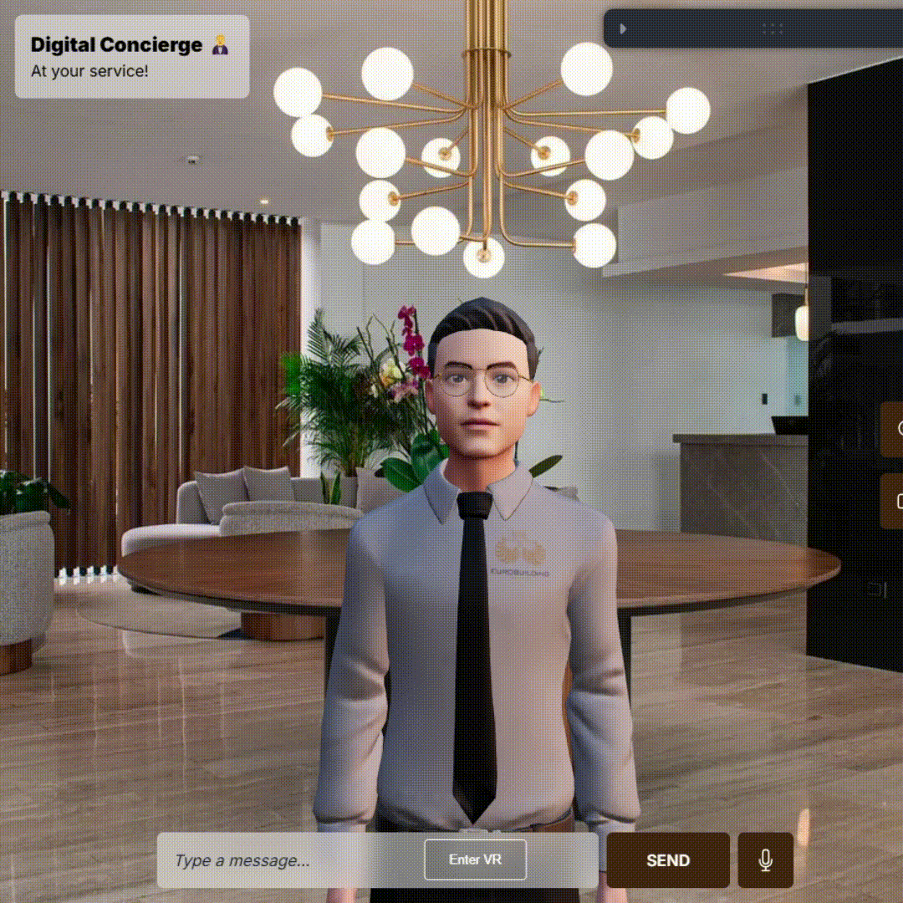

# Holo-cierge 👨‍💼🛎️

<p>
    
    
    
    
    
    
    
    
    
</p>

**Holo-cierge** is an innovative 3D digital concierge that bridges cutting-edge AI, immersive holographic display technology, and advanced animation to redefine guest services in hospitality. The system leverages **`ReactJS`**, **`Three.js`**, and **`Node.js`** to create an interactive, lifelike concierge experience compatible with [**Looking Glass**](https://lookingglassfactory.com/) holographic displays. By integrating [**OpenAI Whisper**](https://github.com/openai/whisper) for speech recognition and [**OpenAI ChatGPT**](https://openai.com/index/chatgpt/) as its core LLM, Holo-cierge can interpret guest inquiries, respond conversationally, and perform real-world actions such as creating tickets for hotel services through its integration with [**GuestHub**](https://guesthub.io/) hotel management application. Used **Docker** for backend containerization and deployment.

<p>
    
</p>

## 📚 **Table of Contents**
1. [Overview](#overview)
2. [Features](#features)
3. [Installation](#installation)
4. [Usage](#usage)
5. [Tech-Stack](#tech-stack)
6. [Acknowledgements](#acknowledgements)
7. [Resources](#resources)

## Overview 🌠

Holo-cierge represents a leap forward in guest experience management by combining the power of AI and immersive 3D environments. Key highlights include:

- A **lifelike digital concierge** with Mixamo animations for fluid, responsive movement. 💃🤖
- **Speech-to-text integration** powered by **Whisper** for seamless voice interactions. 🎤📝
- **Dynamic speech generation** via **Eleven Labs**, enabling natural, expressive dialogue. 🗨️🔊
- **GuestHub integration** for automated service ticket creation and tracking. 🏨🛎️  
- **Lipsync precision** powered by the **Rhubarb library** with rapid audio conversions using **FFmpeg**. 🎥🎶

## Features 🚀

- **Interactive Holographic Concierge:** Designed for Looking Glass displays, offering an immersive guest interaction experience.
- **Real-time Speech Recognition:** Locally runs Whisper for accurate and private voice processing.
- **Dynamic Speech Generation:** Text responses generated by ChatGPT are vocalized using Eleven Labs, creating a unique, customizable concierge voice.
- **Natural Movement and Expressions:** Incorporates Mixamo animations for responsive life-like movements and Rhubarb lipsync for precise speech synchronization.
- **GuestHub Integration:** Supports real-world actions like creating and managing hotel service tickets.
- **Developer-Friendly Architecture:** Modular backend and frontend design with reusable components.

## Installation 🛠️

### Prerequisites 📦

- Node.js and Yarn for dependency management.
- Python 3.8+ for running Whisper.
- FFmpeg for audio processing.
- Rhubarb Library for lipsync. [*Find here*](https://github.com/DanielSWolf/rhubarb-lip-sync)

### Steps 📋

1. Clone the repository and navigate to the project directory.

```bash
git clone https://github.com/rorosaga/holo-cierge.git
```
```bash
cd holo-cierge
```

2. **Backend Setup:**

- Navigate to `concierge-backend` directory and install dependencies.

```bash
cd concierge-backend
```
```bash
yarn
```

- Set up the environment variables:
>- Create a `.env` file based on `.env.example` and add your OpenAI API key, ElevenLabs API key, and Rhubarb executable path.

- Set up **Whisper** env:
```bash
python -m venv venv
```
- Activate the virtual environment:
```bash
source venv/bin/activate # MacOS/Linux
```
or
```bash
.\venv\Scripts\activate # Windows
```
- Install dependencies:
```bash
pip install -r requirements.txt
```

3. **Frontend Setup:**
- Navigate to `concierge-frontend` directory and install dependencies.

```bash
cd ../concierge-frontend
```
```bash
yarn
```

4. Install FFmpeg:
- For MacOS:
```bash
brew install ffmpeg
```
- For Windows:
> Download the latest build from [here](https://ffmpeg.org/download.html) and add the `bin` directory to your system's PATH.

5. **Start the development servers:**
- Open two terminal windows, one in `concierge-backend` and the other in `concierge-frontend`.
- Start the backend server:
```bash
yarn dev
```
- Start the frontend server:
```bash
yarn start
```

## Usage 🎮

1. **Activate the Avatar:** Place the holographic display in front of the guest.
2. **Engage in Conversation:** Speak directly to the concierge. Whisper will transcribe the audio, and ChatGPT will generate a contextual response. Guest can also type their queries thorugh the input box.
3. **Perform Actions:** Trigger actions such as ticket creation through GuestHub.


## Acknowledgements 🙌

Massive thanks to [Wawa Sensei](https://www.youtube.com/@WawaSensei) for his amazing tutorials. Don't think twice to check him out, he is an amazing sensei with a great community!! 🥋🎓

- Wawa Sensei frontend repo [here](https://github.com/wass08/r3f-virtual-girlfriend-frontend)

- Wawa Sensei backend repo [here](https://github.com/wass08/r3f-virtual-girlfriend-backend)

> **Note:** This project is a fork of the original project by Wawa Sensei. We have added new features, integrations, and improvements to the existing project. Wawa Sensei doesn't have this licensed, but their work is deeply appreciated!

## Resources 🧾

- [Rhubarb Library](https://github.com/DanielSWolf/rhubarb-lip-sync) - Lip sync library
- [Ready Player Me](https://readyplayer.me/) - Avatar creator
- [mixamo](https://www.mixamo.com/) - 3D animations
- [OpenAI](https://platform.openai.com/) - GPT API
- [OpenAI Whisper](https://github.com/openai/whisper) - speech-to-text model
- [Three.js](https://threejs.org/) - 3D library
- [Eleven Labs](https://elevenlabs.io/) - text-to-speech API
- [Looking Glass WebXR Library](https://github.com/Looking-Glass/looking-glass-webxr) - WebXR library for Looking Glass devices
- [Looking Glass Bridge](https://lookingglassfactory.com/software/looking-glass-bridge) - software to connect to the Looking Glass device
