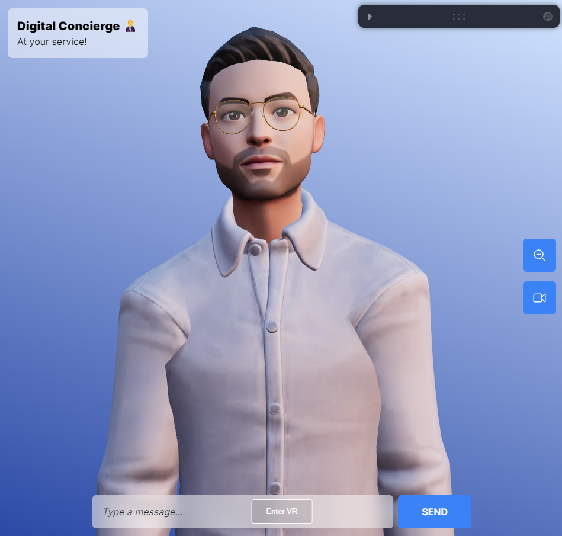

# Holo-cierge

## Notes
- Token limit for GPT and ElevenLabs APIs can be modified. Very short by default.

## Installation

1. Clone this repository with `git clone`.

2. Open two terminal windows, one `./concierge-backend` directory, and one in `./concierge-frontend` directory.

3. In both terminal windows, run `yarn` to install the necessary dependencies.

4. Install ffmpeg with `brew install ffmpeg` for MacOS. For Windows, download the latest build from [here](https://ffmpeg.org/download.html) and add the `bin` directory to your system's PATH.

5. Create a `/bin` directory in `./concierge-backend` directory and download the **RhubarbLibrary** binary for your **OS** [here](https://github.com/DanielSWolf/rhubarb-lip-sync/releases). Extract the zip file and put the contents in the `/bin` directory. The `rhubarb` executable should be accessible through `./bin/rhubarb.exe`.

6. Create a `.env` file in the `./concierge-backend` directory and add your **OpenAI API Key**, **ElevenLabs API Keys**, and **rhubarb.exe path**. Refer to `.env.example` for the environment variable names.

7. Start the development server in both terminal windows with `yarn dev`.

## Credits

Special thanks to [Wawa Sensei's Tutorial](https://www.youtube.com/watch?v=EzzcEL_1o9o)!

- Wawa Sensei frontend repo [here](https://github.com/wass08/r3f-virtual-girlfriend-frontend)

- Wawa Sensei backend repo [here](https://github.com/wass08/r3f-virtual-girlfriend-backend)

## Resources

- [Rhubarb Library](https://github.com/DanielSWolf/rhubarb-lip-sync) - Lip sync library
- [Ready Player Me](https://readyplayer.me/) - Avatar creator
- [mixamo](https://www.mixamo.com/) - 3D animations
- [OpenAI](https://platform.openai.com/) - GPT API
- [Eleven Labs](https://elevenlabs.io/) - text-to-speech API
- [Looking Glass WebXR Library](https://github.com/Looking-Glass/looking-glass-webxr)
- [Looking Glass Bridge](https://lookingglassfactory.com/software/looking-glass-bridge) - software to connect to the Looking Glass device
